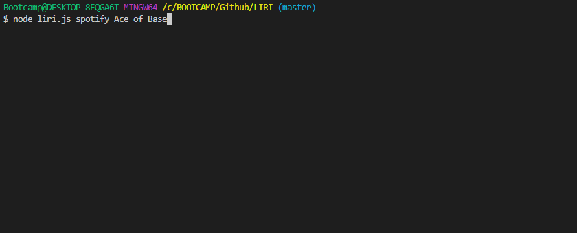
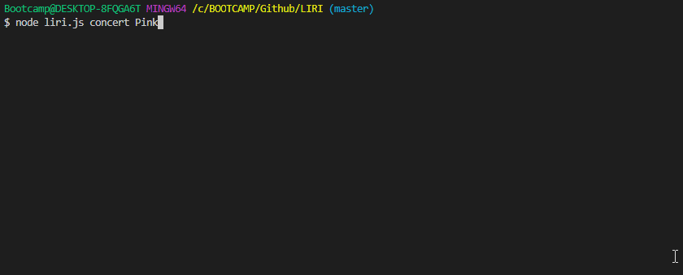
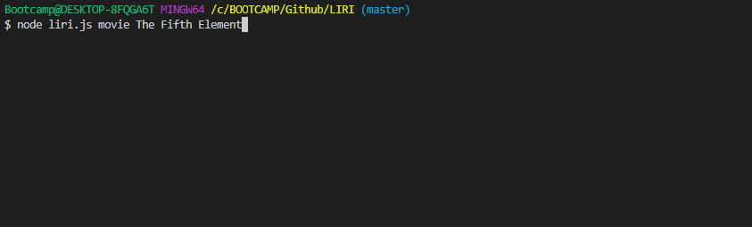
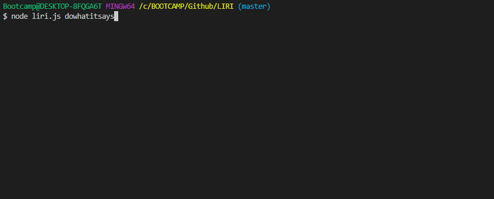

# liri-node-app

This is a command line node app to call useful information.

Current functions:

spotify: Invoke the spotify command followed by the name a song to search the spotify databaase for information about that song.

concert: Invoke the concert copmmand followed by a band name to find various gigs that band will be playing soon.

movie: Invoke it and you shall be rewarded with a search for information about a movie.

dowhatitsays: Invoke and it does its own thing.

